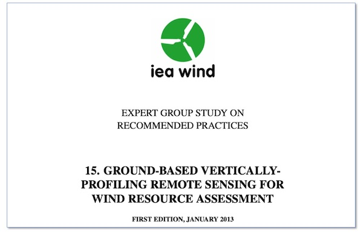

# IEA Wind Recommended Practice 15 (RP 15) on Ground-Based Vertically-Profiling Remote Sensing For Wind Resource Assessment.
This is a repository for the IEA Wind Recommended Practice 15 (RP 15) on Ground-Based Vertically-Profiling Remote Sensing For Wind Resource Assessment.

RP15 was produced by members of [IEA Wind Task 32](http://community.ieawind.org/task32/) in 2013. 

# Version 1.0
The first version of RP 15 was released in January 2013. A PDF of that document is [included in this repository as the 1.0 release](./../../releases/tag/1.0).

# How to provide feedback to the Recommended Practice
There are two ways to provide feedback to RP15.

## Through Github
You can provide feedback to RP 15 by [raising an issue](./../../issues). Before you raise an issue, please take a few minutes to check if there is a similar one in the list already.

**You will have to be logged in to Github to provide feedback**. This means that your feedback will be associated with your username, which may make it possible to identify you. We prefer to have feedback associated with a name because RP15 is a community document.

## Via the IEA Wind Task 32 Operating Agent
Please send your feedback to [ieawind.task32@ifb.uni-stuttgart.de](mailto:ieawind.task32@ifb.uni-stuttgart.de). Please note that your email may be forwarded in its entirety to the rest of the author team. If you need anonymity, please indicate this in your email. Your email should include:
- **Section** What section of RP15 does this feedback apply to?
- **Issue or challenge:** What is the problem, issue, or challenge?
- **Proposal:** What would you like to see instead?
- **More information:** Where can we get more information? Please provide e.g. a URL.
